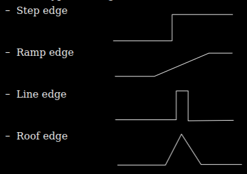
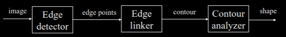

# What we've learnt

- Binary image analysis
- Basic image enhancement
- Image segmentation
  - Color-based
  - region-based
  - watershed segmentation

# Image Edge
A significant local change in the image intensities

How is edge produced?

- Discontinuity in image intensities
  - depth
  - material
  - shading
  - color

Discontinuity in the 1st order derivative of intensity.

## Edge -> Shape

- Edge point (or edge)
  - an image point where significant local changes present
- Edge fragment
- Edge detector
  - an algorithm that finds edge points
- Contour
  - A list of edge <- freeform
  - a curve that models the list of edge <- parameteric form
- Edge linking
  - a process of forming an ordered list of edges
- Edge following
  - a process of searching the image to determine contours

## Image Gradient
Image gradient measures the intensity changes
$$
\nabla I(x,y) = \begin{bmatrix} \frac{\delta I(x,y)}{\delta x} \\ \frac{\delta I(x,y)}{\delta y}
\end{bmatrix}
$$

Properties:

Magnitude:
$$
||\nabla I(x,y)|| = \sqrt{\left(\frac{\delta I(x,y)}{\delta x}\right)^2 + \left(\frac{\delta I(x,y)}{\delta y}\right)^2}
$$

Direction:
$$
\theta(x,y) = \tan^-1\left(\frac{\frac{\delta I(x,y)}{\delta x}}{\frac{\delta I(x,y)}{\delta y}}\right)
$$

We can find the gradient using kernels and performing a convolution.

$$
\text{Sobel Operators}\\
\begin{bmatrix}
-1 & 0 & 1 \\
-2 & 0 & 2 \\
-1 & 0 & 1
\end{bmatrix}_{G_x}
\,\,
\begin{bmatrix}
1 & 2 & 1 \\
0 & 0 & 0 \\
-1 & -2 & -1
\end{bmatrix}_{G_y}
\\
\text{Prewitt Operators}\\
\begin{bmatrix}
-1 & 0 & 1 \\
-1 & 0 & 1 \\
-1 & 0 & 1
\end{bmatrix}_{G_x}
\,\,
\begin{bmatrix}
1 & 1 & 1 \\
0 & 0 & 0 \\
-1 & -1 & -1
\end{bmatrix}_{G_y}
\\
\text{Robert Cross Operators}\\
\begin{bmatrix}
1 & 0 \\ 0 & -1
\end{bmatrix}_{G_x}
\,\,
\begin{bmatrix}
0 & -1 \\ 1 & 0
\end{bmatrix}_{G_y}
$$

Steps in edge detection
- Filtering -> get rid of image noise
- Enhancement -> get salient information
- Detection -> extracting strong edge contents

## Derivative of Gaussian
- Filtering <- Gaussian Kernel
- Enhance <- 1st order derivative
- Detection <- thresholding

$$
h(x,y) = \nabla\left[g(x,y) \times I(x,y)\right] = \left[\nabla g(x,y) \right] \times I(x,y) \\
\nabla g(x,y) = \begin{bmatrix}
-\frac{x}{\sigma^2}e^{-\frac{x^2+y^2}{2\sigma^2}} \\
-\frac{y}{\sigma^2}e^{-\frac{x^2+y^2}{2\sigma^2}}
\end{bmatrix}
$$

We can use second order derivative to find local maximum. (Laplacian operator)